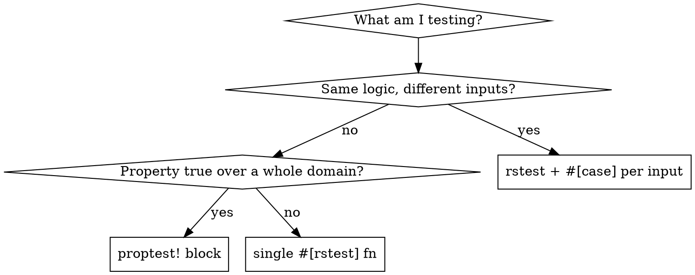

# Writing Rust Tests

## Overview

This is a Cargo workspace (edition 2024). Tests here follow three non-negotiable defaults:

1. **`#[rstest]`, not bare `#[test]`.** Every test function is annotated `#[rstest]`, even when it takes no cases yet. This keeps the whole suite uniform and lets any test grow cases without a rewrite.
2. **Parametrize with `#[case]`, never duplicate.** Two or more test functions that differ only in input/expected values ARE ONE parametrized test. A hand-rolled `for` loop over inputs IS a parametrized test written wrong.
3. **Reach for `proptest` when the property holds over a whole domain**, not just the few points you picked.

**Violating the letter of these rules is violating the spirit.** "It's only two cases" and "a loop is basically the same" are how the suite rots into scattered, unreadable `#[test]` functions.

## When to Use

- Adding a new function/type and covering it with tests.
- Adding cases to existing tests, or a new `crates/<crate>/tests/*.rs` integration test.
- The user says "write tests", "add coverage", "test this", or "run the tests".
- You are about to write `#[test]`, a `for` loop inside a test, or the second near-identical test function.

## The Decision



`rstest` and `proptest` are already workspace dev-deps (see `crates/hm-common`). If a crate needs them, add to its `[dev-dependencies]`.

## Core Pattern

Collapse duplicated functions and hand-rolled loops into one parametrized `#[rstest]`.

**Before** — scattered `#[test]` functions + a loop doing parametrization by hand:

```rust
#[cfg(test)]
mod tests {
    use super::*;

    #[test]
    fn one_is_singular() { assert_eq!(pluralize(1, "file", "files"), "file"); }

    #[test]
    fn zero_is_plural() { assert_eq!(pluralize(0, "file", "files"), "files"); }

    #[test]
    fn two_is_plural() { assert_eq!(pluralize(2, "file", "files"), "files"); }

    #[test]
    fn range_is_plural_except_one() {
        for count in 0..=5 {
            let expected = if count == 1 { "item" } else { "items" };
            assert_eq!(pluralize(count, "item", "items"), expected, "count = {count}");
        }
    }
}
```

**After** — one parametrized test; each case names itself and fails independently:

```rust
#[cfg(test)]
mod tests {
    use super::*;
    use rstest::rstest;

    #[rstest]
    #[case::one_singular(1, "file")]
    #[case::zero_plural(0, "files")]
    #[case::two_plural(2, "files")]
    #[case::large_plural(1_000_000, "files")]
    #[case::max_plural(usize::MAX, "files")]
    fn selects_singular_only_for_one(#[case] count: usize, #[case] expected: &str) {
        assert_eq!(pluralize(count, "file", "files"), expected);
    }
}
```

A hand-rolled loop reports only the first failing iteration and hides the input in a message string; five `#[case]`s each show up as a named subtest (`selects_singular_only_for_one::case_1_one_singular`) and all run even when one fails.

When the claim is "true for *every* value, not just these", use `proptest` (see `crates/hm-common/src/format.rs` for a real example):

```rust
proptest! {
    #[test]
    fn only_exactly_one_is_singular(count in any::<usize>()) {
        let got = pluralize(count, "file", "files");
        prop_assert_eq!(got == "file", count == 1);
    }
}
```

## Repo Conventions (do not skip)

- **Clippy is strict workspace-wide.** `unwrap_used`, `expect_used`, and `panic` are `warn`. Test modules that unwrap/assert-panic need a module-level allow WITH a reason:
  ```rust
  #[cfg(test)]
  #[allow(clippy::unwrap_used, reason = "test setup and assertions")]
  mod tests { ... }
  ```
- **Filesystem tests use `tempfile::tempdir()`**, never a hardcoded `/tmp` path. See `crates/hm-common/src/fs.rs`.
- **Integration tests** live in `crates/<crate>/tests/*.rs`. CLI tests drive the built binary with `assert_cmd::Command::cargo_bin("hm")` + `predicates`; HTTP is mocked with `wiremock`. Reuse the `crates/hm/tests/common/mod.rs` helpers (`hm_bin`, `hm_command`) instead of re-wiring env vars.
- **Prefer stderr assertions** for CLI output — this repo routes user messages through `tracing` (stderr), not `println`.

## Running Tests

Plain `cargo test` — there is no nextest/just/make wrapper here. Always scope while iterating:

- One crate: `cargo test -p hm-common`
- One test/module by name: `cargo test -p hm-common plural::`
- Whole workspace before you claim done: `cargo test`

Do not report tests as passing until you have run the command and seen it pass.

## Red Flags — STOP

| Thought | Reality |
|---------|---------|
| "It's just one test, `#[test]` is fine" | Every test is `#[rstest]`. Uniform suite, zero-cost to add cases later. |
| "Only two cases, not worth parametrizing" | Two cases differing only in values = one `#[rstest]` with two `#[case]`s. |
| "I'll loop over the inputs" | A `for` loop in a test is parametrization done wrong. Use `#[case]`. |
| "I'll copy this test and tweak the numbers" | The copy is a `#[case]` on the original, not a new function. |
| "These few values prove it" | If the claim is domain-wide, use `proptest`, not cherry-picked points. |
| "The unwrap warning is noise" | Add `#[allow(clippy::unwrap_used, reason = "...")]` on the module — with a reason. |
| "I'll use /tmp for the file test" | `tempfile::tempdir()`. Always. |

## Common Mistakes

- Bare `#[test]` on a function that could take cases → make it `#[rstest]`.
- Duplicated test functions differing only in literals → collapse to `#[case]`s.
- Unlabeled cases (`#[case(1, "file")]`) → prefer `#[case::descriptive_name(...)]` so failures read well.
- A loop asserting over a list of inputs → `#[case]` per input.
- Missing the `reason = "..."` on a clippy `allow` → the lint config expects it.
